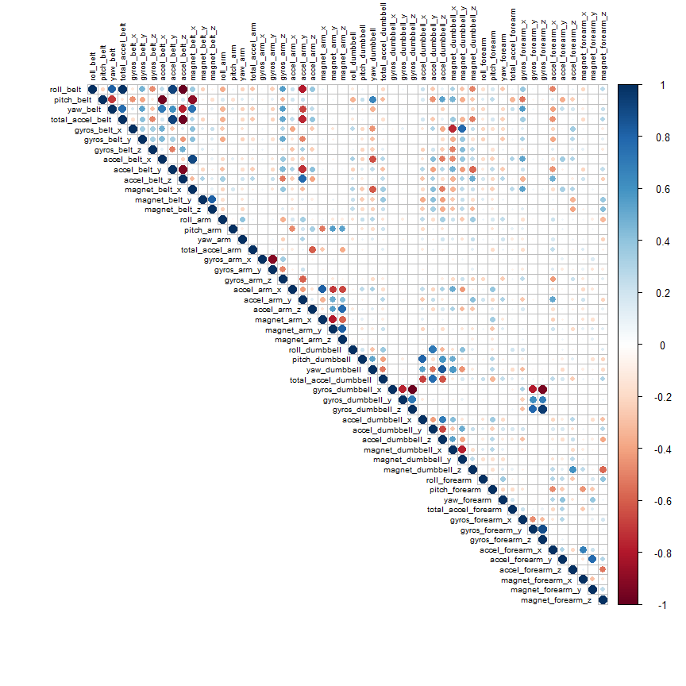

# Practical Machine Learning - Prediction Assignment Writeup


```
## by Alejandro Serrano
```

```
## Date:  mar. 05 Jul. 2016
```

```
## R version 3.2.2 (2015-08-14)
```

# Background

Using devices such as Jawbone Up, Nike FuelBand, and Fitbit it is now possible to collect a large amount of data about personal activity relatively inexpensively. These type of devices are part of the quantified self movement - a group of enthusiasts who take measurements about themselves regularly to improve their health, to find patterns in their behavior, or because they are tech geeks. One thing that people regularly do is quantify how much of a particular activity they do, but they rarely quantify *how well they do it*. In this project, your goal will be to use data from accelerometers on the belt, forearm, arm, and dumbell of **6 participants**. They were asked to perform barbell lifts correctly and incorrectly in **5 different ways**. 

*Six young health participants were asked to perform one set of 10 repetitions of the Unilateral Dumbbell Biceps Curl in five different fashions: exactly according to the specification (Class A), throwing the elbows to the front (Class B), lifting the dumbbell only halfway (Class C), lowering the dumbbell only halfway (Class D) and throwing the hips to the front (Class E).*

*Class A corresponds to the specified execution of the exercise, while the other 4 classes correspond to common mistakes. Participants were supervised by an experienced weight lifter to make sure the execution complied to the manner they were supposed to simulate. The exercises were performed by six male participants aged between 20-28 years, with little weight lifting experience. We made sure that all participants could easily simulate the mistakes in a safe and controlled manner by using a relatively light dumbbell (1.25kg).*

More information is available from the website here: [http://groupware.les.inf.puc-rio.br/har](http://groupware.les.inf.puc-rio.br/har) (see the section on the Weight Lifting Exercise Dataset).

The training & testing data for this project are available here:

* https://d396qusza40orc.cloudfront.net/predmachlearn/pml-training.csv
* https://d396qusza40orc.cloudfront.net/predmachlearn/pml-testing.csv


# Data Loading and Exploratory Analysis

## Loading R packages and default values

First, clear the environment to ensure that everything is defined and set the working directory. Also, upload the necessary R libraries.


```r
rm(list=ls(all=TRUE))
knitr::opts_chunk$set(cache=TRUE)

setwd(paste0(COURSERADIR, "./08 - Practical Machine Learning/Quizes and Assigments/Practical_Machine_Learning"))

library(caret)
library(gbm)
library(randomForest)
library(corrplot)
```

## Getting data

The data come in the form of a comma-separated-value file that can download from a URL. We can download and store in memory. We consider any of "NA","#DIV/0!" or "" as NULL value.


```r
URL_train <- "https://d396qusza40orc.cloudfront.net/predmachlearn/pml-training.csv"
URL_test <- "https://d396qusza40orc.cloudfront.net/predmachlearn/pml-testing.csv"

training <- read.csv(url(URL_train), na.strings=c("NA","#DIV/0!",""))
testing <- read.csv(url(URL_test), na.strings=c("NA","#DIV/0!",""))

str(training, list.len=18)
```

```
## 'data.frame':	19622 obs. of  160 variables:
##  $ X                       : int  1 2 3 4 5 6 7 8 9 10 ...
##  $ user_name               : Factor w/ 6 levels "adelmo","carlitos",..: 2 2 2 2 2 2 2 2 2 2 ...
##  $ raw_timestamp_part_1    : int  1323084231 1323084231 1323084231 1323084232 1323084232 1323084232 1323084232 1323084232 1323084232 1323084232 ...
##  $ raw_timestamp_part_2    : int  788290 808298 820366 120339 196328 304277 368296 440390 484323 484434 ...
##  $ cvtd_timestamp          : Factor w/ 20 levels "02/12/2011 13:32",..: 9 9 9 9 9 9 9 9 9 9 ...
##  $ new_window              : Factor w/ 2 levels "no","yes": 1 1 1 1 1 1 1 1 1 1 ...
##  $ num_window              : int  11 11 11 12 12 12 12 12 12 12 ...
##  $ roll_belt               : num  1.41 1.41 1.42 1.48 1.48 1.45 1.42 1.42 1.43 1.45 ...
##  $ pitch_belt              : num  8.07 8.07 8.07 8.05 8.07 8.06 8.09 8.13 8.16 8.17 ...
##  $ yaw_belt                : num  -94.4 -94.4 -94.4 -94.4 -94.4 -94.4 -94.4 -94.4 -94.4 -94.4 ...
##  $ total_accel_belt        : int  3 3 3 3 3 3 3 3 3 3 ...
##  $ kurtosis_roll_belt      : num  NA NA NA NA NA NA NA NA NA NA ...
##  $ kurtosis_picth_belt     : num  NA NA NA NA NA NA NA NA NA NA ...
##  $ kurtosis_yaw_belt       : logi  NA NA NA NA NA NA ...
##  $ skewness_roll_belt      : num  NA NA NA NA NA NA NA NA NA NA ...
##  $ skewness_roll_belt.1    : num  NA NA NA NA NA NA NA NA NA NA ...
##  $ skewness_yaw_belt       : logi  NA NA NA NA NA NA ...
##  $ max_roll_belt           : num  NA NA NA NA NA NA NA NA NA NA ...
##   [list output truncated]
```

```r
dim(testing)
```

```
## [1]  20 160
```


## Data cleanning

Since predictor candidates must have data, we first eliminate fully NULL variables. The very low variance (NZV) variables and the ID are also removed.


```r
train <- training[ , colSums(is.na(training)) == 0]
test <- testing[ , colSums(is.na(testing)) == 0]

train <- train[, -nearZeroVar(train)]
test <- test[, -nearZeroVar(test)]

train <- train[, -c(1, 3:6)]
test <- test[, -c(1, 3:6)]

str(train, list.len=18)
```

```
## 'data.frame':	19622 obs. of  54 variables:
##  $ user_name           : Factor w/ 6 levels "adelmo","carlitos",..: 2 2 2 2 2 2 2 2 2 2 ...
##  $ roll_belt           : num  1.41 1.41 1.42 1.48 1.48 1.45 1.42 1.42 1.43 1.45 ...
##  $ pitch_belt          : num  8.07 8.07 8.07 8.05 8.07 8.06 8.09 8.13 8.16 8.17 ...
##  $ yaw_belt            : num  -94.4 -94.4 -94.4 -94.4 -94.4 -94.4 -94.4 -94.4 -94.4 -94.4 ...
##  $ total_accel_belt    : int  3 3 3 3 3 3 3 3 3 3 ...
##  $ gyros_belt_x        : num  0 0.02 0 0.02 0.02 0.02 0.02 0.02 0.02 0.03 ...
##  $ gyros_belt_y        : num  0 0 0 0 0.02 0 0 0 0 0 ...
##  $ gyros_belt_z        : num  -0.02 -0.02 -0.02 -0.03 -0.02 -0.02 -0.02 -0.02 -0.02 0 ...
##  $ accel_belt_x        : int  -21 -22 -20 -22 -21 -21 -22 -22 -20 -21 ...
##  $ accel_belt_y        : int  4 4 5 3 2 4 3 4 2 4 ...
##  $ accel_belt_z        : int  22 22 23 21 24 21 21 21 24 22 ...
##  $ magnet_belt_x       : int  -3 -7 -2 -6 -6 0 -4 -2 1 -3 ...
##  $ magnet_belt_y       : int  599 608 600 604 600 603 599 603 602 609 ...
##  $ magnet_belt_z       : int  -313 -311 -305 -310 -302 -312 -311 -313 -312 -308 ...
##  $ roll_arm            : num  -128 -128 -128 -128 -128 -128 -128 -128 -128 -128 ...
##  $ pitch_arm           : num  22.5 22.5 22.5 22.1 22.1 22 21.9 21.8 21.7 21.6 ...
##  $ yaw_arm             : num  -161 -161 -161 -161 -161 -161 -161 -161 -161 -161 ...
##  $ total_accel_arm     : int  34 34 34 34 34 34 34 34 34 34 ...
##   [list output truncated]
```

```r
dim(test)
```

```
## [1] 20 54
```

## Slicing data

First, we need to split the training set into two for cross validation purposes. We randomly subsample 60% for training and 40% for testing. 


```r
set.seed(123456)
toTrain <- createDataPartition(y=training$classe, p=0.60, list=FALSE)

inTrain  <- train[toTrain,]
inTest  <- train[-toTrain,]

dim(inTrain)
```

```
## [1] 11776    54
```

```r
dim(inTest)
```

```
## [1] 7846   54
```

## Correlation plot

54 variables are predicor candidates. Let's make first a correlation matrix among all variables. Only numeric variabls can be evaluated in this way. Only half of the plot is neede.


```r
corrMatrix <- cor(na.omit(inTrain[sapply(inTrain, is.numeric)]))
corrplot(corrMatrix, type = "upper", tl.cex = 0.6, tl.col = 1)
```

<!-- -->

The plot shows very low higly correlated variables. 

# Prediction

## Variable to predict.

The variable **Classe** is the one to predict. Let's explore it.


```r
prop.table(table(inTrain$user_name, inTrain$classe), 1)
```

```
##           
##                    A         B         C         D         E
##   adelmo   0.2952421 0.2056075 0.1911640 0.1312659 0.1767205
##   carlitos 0.2683706 0.2172524 0.1640043 0.1549521 0.1954207
##   charles  0.2567504 0.2084320 0.1525343 0.1833254 0.1989578
##   eurico   0.2833426 0.1920310 0.1660210 0.1848367 0.1737687
##   jeremy   0.3443259 0.1440349 0.1881668 0.1561591 0.1673133
##   pedro    0.2461637 0.1937340 0.1828645 0.1835038 0.1937340
```

## Training the prediction models

Random forest ("rf"), Stochastic Gradient Boosting ("gbm") and linear discriminant analysis ("lda") models will be used to predict the **classe**. Then we look which of them provides the best accuracty. Since the models are slow to train, we woult better save the model after trainning.


```r
set.seed(123456)

# Random Forest - VERY SLOW
mod_rf <- train(classe ~ ., data = inTrain, method = "rf")
# Stochastic Gradient Boosting - VERY SLOW
mod_gbm <- train(classe ~ ., data = inTrain, method = "gbm", verbose = FALSE)
# Linear discriminant analysis - FAST
mod_lda <- train(classe ~ ., data = inTrain, method = "lda")

save(mod_rf, file="mod_rf.RData")
save(mod_gbm, file="mod_gbm.RData")
save(mod_lda, file="mod_lda.RData")
```

If necessary, it is possible to load the trained models (in my PC, takes more than 2 hours to compute the train).


```r
load(file="mod_rf.RData")
load(file="mod_gbm.RData")
load(file="mod_lda.RData")
```


## Testing the prediction models

Evaluating the model on the probing dataset.


```r
pred_rf <- predict(mod_rf, inTest)
pred_gbm <- predict(mod_gbm, inTest)
pred_lda <- predict(mod_lda, inTest)
```

We compute the Confusoin Matrix to evaluate the accuracy of each model.


```r
# Accuracy using random forests
CM_rf <- confusionMatrix(pred_rf, inTest$classe)$overall[1]
# Accuracy using boosting
CM_gmb <- confusionMatrix(pred_gbm, inTest$classe)$overall[1]
# Accuracy using linear discriminant analysis
CM_lda <- confusionMatrix(pred_lda, inTest$classe)$overall[1]

format(data.frame(CM_rf, CM_gmb, CM_lda), digits=2)
```

```
##          CM_rf CM_gmb CM_lda
## Accuracy  0.99   0.96   0.74
```

The best model appears to be the Random Forest with an accuracy of 99%. we can display the model to see the most important variables.


```r
varImp(mod_rf)
```

```
## rf variable importance
## 
##   only 20 most important variables shown (out of 57)
## 
##                      Overall
## roll_belt             100.00
## pitch_forearm          59.18
## yaw_belt               52.01
## magnet_dumbbell_z      44.14
## pitch_belt             43.64
## magnet_dumbbell_y      41.93
## roll_forearm           40.75
## accel_dumbbell_y       22.55
## accel_forearm_x        19.50
## magnet_dumbbell_x      18.78
## roll_dumbbell          18.54
## magnet_belt_z          17.55
## accel_belt_z           14.90
## magnet_forearm_z       14.69
## total_accel_dumbbell   14.59
## accel_dumbbell_z       14.35
## magnet_belt_y          12.68
## yaw_arm                12.23
## gyros_belt_z           12.09
## magnet_belt_x          12.02
```

```r
mod_rf$finalModel
```

```
## 
## Call:
##  randomForest(x = x, y = y, mtry = param$mtry) 
##                Type of random forest: classification
##                      Number of trees: 500
## No. of variables tried at each split: 29
## 
##         OOB estimate of  error rate: 0.81%
## Confusion matrix:
##      A    B    C    D    E class.error
## A 3341    3    3    0    1 0.002090800
## B   23 2250    5    1    0 0.012724879
## C    0   14 2027   13    0 0.013145083
## D    0    0   22 1907    1 0.011917098
## E    0    0    3    6 2156 0.004157044
```

The estimated error rate is less than 1%.


## Predicting with the models

We use the best model to predict the Test sample: Random Forest


```r
pred_rf_test <- predict(mod_rf, test)
pred_rf_test
```

```
##  [1] B A B A A E D B A A B C B A E E A B B B
## Levels: A B C D E
```

